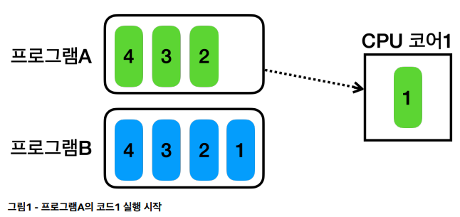
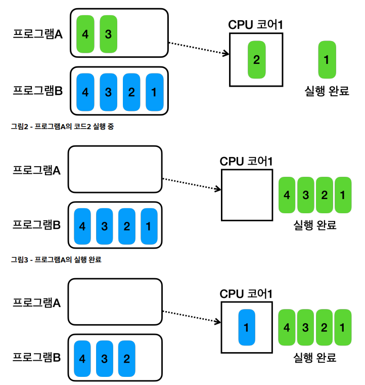
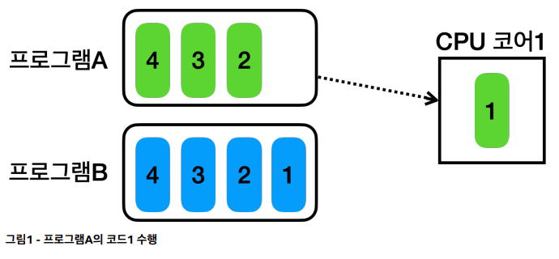
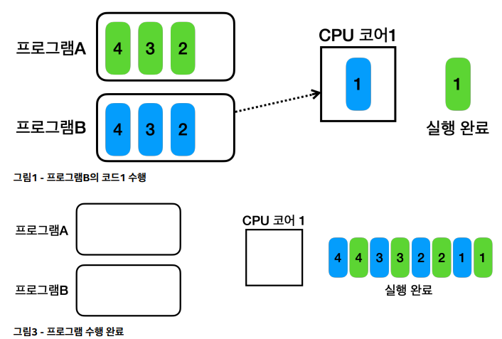
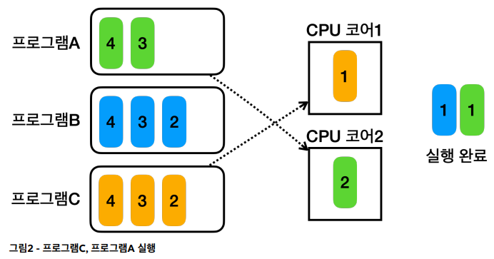
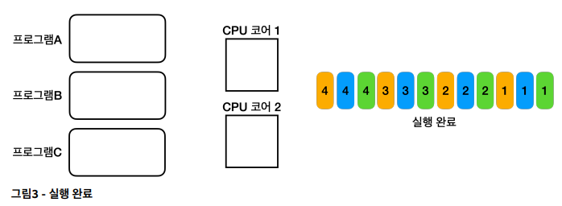

## 섹션 2 : 프로세스와 스레드 소개

### 목차

> 1. 멀티태스킹과 멀티프로세싱
> 2. 프로세스와 스레드
> 3. 스레드와 스케줄링
> 4. 컨텍스트 스위칭

### 1. 멀티태스킹과 멀티프로세싱

#### 단일 프로그램 실행

> `프로그램 실행`이란 **프로그램을 구성하는 코드를 순서대로 CPU 에서 실행(연산)하는 일**이다.

- 만약 2개의 프로그램을 실행하고, CPU 에서 연산을 처리하는 코어가 1개라면 다음 그림과 같이 연산이된다.

  

  
- 위와 같은 경우에는 사용자가 음악을 들으면서 워드문서를 작성한다면 음악을 다 들은 후에 워드 문서를 작성할 수 있게 된다.
- 이는 사용자 입장에서 매우 답답하게 느껴지게 된다. 이를 해결하기 위해 **CPU 코어로 여러 프로그램을 동시에 실행**하는 `멀티 태스킹` 기술이 등장했다.

#### 멀티 태스킹

- 순서대로 촬영한 사진을 빠르게 교차해서 보여줄 경우 사람은 이를 영상으로 인지하게 된다.
- `멀티 태스킹`도 위와 유사하게 **하나의 CPU 코어로 두 프로그램의 코드를 빠르게 번갈아 가면서 수행**하게 된다.
  - OS나 환경에 따라 다르겠지만 *대략 10ms 단위로 번갈아가며 실행*된다.

  

  
- 위와 같이 **각 프로그램의 실행 시간을 분할해서 마치 동시에 실행**되는 것 처럼 하는 기법을 `시분할(Time Sharing) 기법`이라 한다.
- 이렇게 **하나의 컴퓨터에서 시스템이 동시에 여러 작업을 수행하는 능력**을 `멀티태스킹(MultiTasking)`이라 한다.

#### 스케줄링

- **CPU에 어떤 프로그램이 얼마만큼 실행될지는 운영체제가 결정**하는데 이것을 `스케줄링(Scheduling)`이라 한다.
- 이 때 단순히 시간으로만 작업하는 시분할 기법이 아닌 *CPU를 최대한 활용할 수 있는 다양한 우선순위와 최적화 기법을 사용*한다.

#### 멀티 프로세싱

- `멀티프로세싱(MultiProcessing)`은 컴퓨터 시스템에서 **둘 이상의 프로세서(CPU 코어)를 사용하여 여러 작업을 동시에 처리하는 기술**을 의미한다.
- 멀티프로세싱은 *하나의 CPU 코어만을 사용하는 시스템보다 동시에 더 많은 작업을 처리*할 수 있다.

  

  
- 멀티테스킹과 멀티프로세싱은 다음과 같다.

  | `멀티 프로세싱(Multi Processing)` | `멀티 테스킹(Multi Tasking)`            |
  |-----------------------------|------------------------------------|
  | 여러 CPU를 사용하여 동시에 여러 작업 수행   | 단일 CPU가 여러 작업을 동시에 수행하는 것처럼 보이게 실행 |
  | 하드웨어 기반으로 성능 향상             | 소프트웨어 기반으로 CPU 시간을 분할하여 각 작업 할당    |
- 